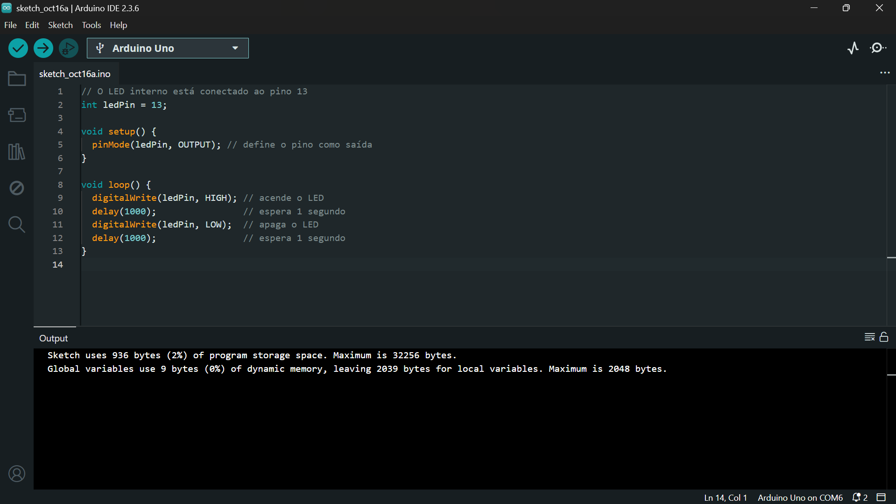
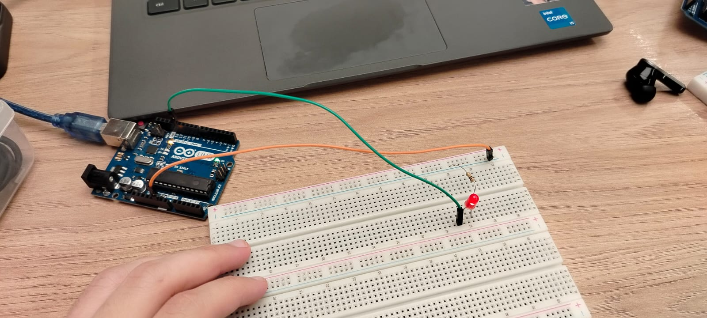
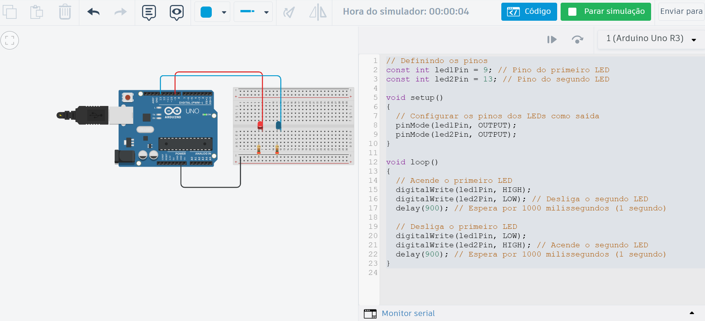

# Entrega 01 — Blink Interno e Simulação no Tinkercad

Este repositório contém as evidências das atividades de IoT referentes ao Blink interno do Arduino (Parte 1) e à simulação de um blink externo no Tinkercad (Parte 2).

## Parte 1 — Blink com LED Interno (on-board)

Objetivo: Fazer o LED interno do Arduino piscar, mantendo-o aceso por X ms, apagado por Y ms, continuamente.

Passos realizados:

- Instalação e configuração da Arduino IDE.
- Seleção da placa correta (Arduino Uno) e porta serial.
- Upload do código de blink no LED interno (pino LED_BUILTIN, normalmente 13).

Exemplo de código utilizado (referência):

```cpp
// O LED interno está conectado ao pino 13
int ledPin = 13;

void setup() {
  pinMode(ledPin, OUTPUT); // define o pino como saída
}

void loop() {
  digitalWrite(ledPin, HIGH); // acende o LED
  delay(1000);                // espera 1 segundo
  digitalWrite(ledPin, LOW);  // apaga o LED
  delay(1000);                // espera 1 segundo
}
```

Evidências a seguir.

### Vídeo (Parte 1)

- Link do vídeo: https://drive.google.com/file/d/1eouu2_eZGNdbbjaw1-vIiBp00lqK2IrD/view?usp=drive_link

### Imagens (Parte 1)

- Screenshot da Arduino IDE com o código: 

- Foto do Arduino conectado com LED aceso: 

---

## Parte 2 — Simulação de Blink Externo no Tinkercad

Objetivo: Montar no Tinkercad um circuito com Arduino Uno, protoboard, LED off-board e resistor, executando um pisca-pisca de qualquer cadência. Ao iniciar a simulação (Play), o projeto deve rodar sem erros.

Passos realizados:

- Montagem do circuito no Tinkercad (Arduino, protoboard, LED off-board, resistor e fios).
- Definição do pino (ex.: 13 ou 6) como saída: pinMode(PINO, OUTPUT);
- Comando de pisca usando digitalWrite(PINO, HIGH/LOW) e delay.

Tinkercad — Código usado (obtido da simulação):

```cpp
// Definindo os pinos
const int led1Pin = 9; // Pino do primeiro LED
const int led2Pin = 13; // Pino do segundo LED

void setup()
{
  // Configurar os pinos dos LEDs como saída
  pinMode(led1Pin, OUTPUT);
  pinMode(led2Pin, OUTPUT);
}

void loop()
{
  // Acende o primeiro LED
  digitalWrite(led1Pin, HIGH);
  digitalWrite(led2Pin, LOW); // Desliga o segundo LED
  delay(900); // Espera por 1000 milissegundos (1 segundo)

  // Desliga o primeiro LED
  digitalWrite(led1Pin, LOW);
  digitalWrite(led2Pin, HIGH); // Acende o segundo LED
  delay(900); // Espera por 1000 milissegundos (1 segundo)
}

```

### Vídeo (Parte 2)

- Link do vídeo: https://drive.google.com/file/d/1M5YrQoi1XHPhT0iwI920BuM0X14y1n-7/view?usp=sharing

### Imagens (Parte 2)

- Screenshot da simulação no Tinkercad com o circuito: 


---