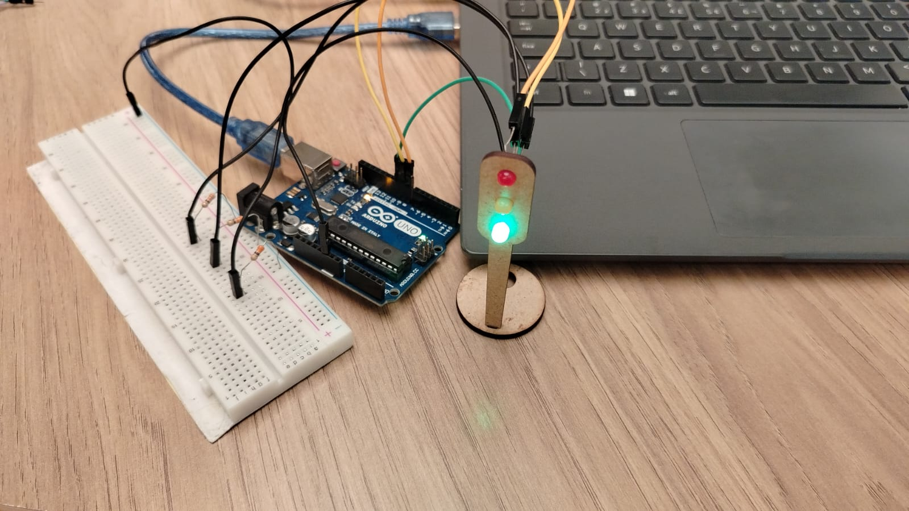

# Atividade Ponderada - Semáforo Offline

**Autor:** Christian Gandra  
**Instituição:** Inteli - Instituto de Tecnologia e Liderança  
**Curso:** Engenharia de Computação  
**Data:** 30 de Outubro de 2025

---

## Introdução

Este projeto foi desenvolvido no contexto de uma simulação prática para o Departamento de Engenharia de Trânsito do Butantã, onde o desafio consiste em criar um sistema de controle semafórico funcional utilizando tecnologias embarcadas. A atividade integra conhecimentos de eletrônica digital e programação em C/C++, aplicados ao desenvolvimento de um semáforo que simula condições reais de controle de tráfego urbano.

---

## Objetivo

Desenvolver um sistema de semáforo funcional utilizando Arduino para controlar o fluxo de trânsito em uma via movimentada. O projeto engloba:

- **Montagem física** de circuito com LEDs e resistores
- **Programação** da lógica de temporização das fases
- **Aplicação prática** de conceitos de eletrônica e programação embarcada

O semáforo deve alternar entre as cores **vermelho**, **amarelo** e **verde** com temporização precisa, garantindo segurança de pedestres e veículos.

---

## Componentes Utilizados

 Esta seção detalha cada componente utilizado, suas especificações técnicas e funções no sistema.

### Tabela de Especificações

| Componente       | Especificação | Quantidade | Função                         |
| ---------------- | ------------- | ---------- | ------------------------------ |
| **Arduino UNO**  | ATmega328P    | 1          | Microcontrolador principal     |
| **LED Vermelho** | 5mm, 2V, 20mA | 1          | Sinalização de parada          |
| **LED Amarelo**  | 5mm, 2V, 20mA | 1          | Sinalização de atenção         |
| **LED Verde**    | 5mm, 2V, 20mA | 1          | Sinalização de passagem        |
| **Resistor**     | 220Ω, 1/4W    | 3          | Limitação de corrente dos LEDs |
| **Protoboard**   | 830 pontos    | 1          | Base para montagem do circuito |
| **Jumpers**      | -             | 7          | Conexões elétricas             |
| **Cabo USB**     | Tipo A/B      | 1          | Alimentação e programação      |

**Conclusão dos Componentes:** Todos os componentes foram selecionados seguindo critérios técnicos de compatibilidade e segurança. Os resistores de 330Ω garantem proteção adequada aos LEDs, prolongando sua vida útil e mantendo o brilho ideal para visualização.

---

## Parte 1: Montagem Física

 Esta etapa exige atenção aos detalhes de polaridade, conexões corretas e organização do circuito para facilitar testes e manutenção.

### Esquema de Conexões

#### Pinagem do Arduino:

- **Pino Digital 8** → LED Vermelho
- **Pino Digital 9** → LED Amarelo
- **Pino Digital 10** → LED Verde
- **GND** → Terra comum (protoboard)

#### Diagrama de Montagem:

```
Arduino UNO
┌─────────────┐
│  D8  ●──────┼──→ R330Ω ──→ LED Vermelho ──→ GND
│  D9  ●──────┼──→ R330Ω ──→ LED Amarelo  ──→ GND
│  D10 ●──────┼──→ R330Ω ──→ LED Verde    ──→ GND
│  GND ●──────┼──→ Linha GND (protoboard)
└─────────────┘
```

### Imagens da Montagem

#### Vista Geral do Circuito


_Legenda: Protoboard com os três LEDs e resistores conectados ao Arduino UNO_


---

## Parte 2: Programação e Lógica

 Esta seção demonstra não apenas o código funcional, mas também a aplicação de conceitos avançados como ponteiros e modularização, elevando a qualidade técnica do projeto.

### Especificação de Temporização

O semáforo segue o ciclo padrão de sinalização viária:

| Fase | Cor             | Tempo      | Significado                   |
| ---- | --------------- | ---------- | ----------------------------- |
| 1    | 🔴 **Vermelho** | 6 segundos | Parada obrigatória            |
| 2    | 🟢 **Verde**    | 4 segundos | Passagem liberada             |
| 3    | 🟡 **Amarelo**  | 2 segundos | Atenção / Preparar para parar |

**Ciclo total:** 12 segundos (repetição contínua)

### Código Implementado

```cpp
// === SEMÁFORO OFFLINE - ATIVIDADE PONDERADA ===

// ==== DEFINIÇÃO DOS PINOS ====
#define LED_VERMELHO 8
#define LED_AMARELO  9
#define LED_VERDE    10

// ==== TEMPOS DE CADA FASE (em milissegundos) ====
const int tempoVermelho = 6000;  // 6 segundos
const int tempoVerde    = 4000;  // 4 segundos
const int tempoAmarelo  = 2000;  // 2 segundos

// ==== ARRAY DE LEDS E PONTEIRO ====
int leds[3] = {LED_VERMELHO, LED_AMARELO, LED_VERDE};
int *ptrLeds = leds;  // ponteiro apontando para o primeiro elemento do array

// ==== FUNÇÕES AUXILIARES ====
void apagarLeds() {
  // percorre o array usando ponteiro e apaga todos os LEDs
  for (int i = 0; i < 3; i++) {
    digitalWrite(*(ptrLeds + i), LOW);
  }
}

void acenderLuz(int indice) {
  apagarLeds();
  digitalWrite(*(ptrLeds + indice), HIGH); // acende o LED indicado
}

void setup() {
  // configuração inicial
  for (int i = 0; i < 3; i++) {
    pinMode(*(ptrLeds + i), OUTPUT);
  }

  // inicia com todos apagados
  apagarLeds();
}

void loop() {
  // Vermelho aceso por 6 segundos
  acenderLuz(0); // *(ptrLeds + 0) → LED_VERMELHO
  delay(tempoVermelho);

  // Verde aceso por 4 segundos
  acenderLuz(2); // *(ptrLeds + 2) → LED_VERDE
  delay(tempoVerde);

  // Amarelo aceso por 2 segundos
  acenderLuz(1); // *(ptrLeds + 1) → LED_AMARELO
  delay(tempoAmarelo);
}
```

### Explicação do Código

#### 1. **Definições e Constantes**

```cpp
#define LED_VERMELHO 8
#define LED_AMARELO  9
#define LED_VERDE    10
```

- Uso de `#define` para criar constantes nomeadas
- Facilita manutenção e legibilidade do código
- Permite mudança fácil dos pinos sem alterar lógica

#### 2. **Variáveis de Temporização**

```cpp
const int tempoVermelho = 6000;
const int tempoVerde    = 4000;
const int tempoAmarelo  = 2000;
```

- Valores em milissegundos
- Uso de `const` garante que não sejam alterados acidentalmente
- Centraliza os tempos em um só lugar

#### 3. **Uso de Ponteiros (Diferencial)**

```cpp
int leds[3] = {LED_VERMELHO, LED_AMARELO, LED_VERDE};
int *ptrLeds = leds;
```

- **Array** armazena os pinos dos LEDs
- **Ponteiro** aponta para o primeiro elemento do array
- Permite manipulação dinâmica e acesso otimizado

#### 4. **Função `apagarLeds()`**

```cpp
void apagarLeds() {
  for (int i = 0; i < 3; i++) {
    digitalWrite(*(ptrLeds + i), LOW);
  }
}
```

- **Aritmética de ponteiros:** `*(ptrLeds + i)` acessa cada LED
- Apaga todos os LEDs antes de acender o próximo
- Evita que múltiplos LEDs fiquem acesos simultaneamente

#### 5. **Função `acenderLuz(int indice)`**

```cpp
void acenderLuz(int indice) {
  apagarLeds();
  digitalWrite(*(ptrLeds + indice), HIGH);
}
```

- Recebe o índice do LED a ser aceso (0=vermelho, 1=amarelo, 2=verde)
- Primeiro apaga todos, depois acende apenas o desejado
- Uso de **desreferência de ponteiro** com offset

#### 6. **Loop Principal**

```cpp
void loop() {
  acenderLuz(0);           // Vermelho
  delay(tempoVermelho);

  acenderLuz(2);           // Verde
  delay(tempoVerde);

  acenderLuz(1);           // Amarelo
  delay(tempoAmarelo);
}
```

- Sequência: Vermelho → Verde → Amarelo (padrão de semáforo brasileiro)
- Repetição infinita automática pela função `loop()`

**Conclusão da Programação:** O código implementado atende plenamente aos requisitos da atividade, com temporização precisa e sequenciamento correto das fases. O uso de ponteiros demonstra domínio de conceitos avançados de programação em C/C++, enquanto a modularização com funções garante legibilidade e manutenibilidade do código. A estrutura desenvolvida permite fácil expansão futura, como adição de mais semáforos ou integração com sensores.

---

### Vídeo de Demonstração

**Link do vídeo:** [https://youtu.be/_99DmmzPzc8?si=b8L1tCLH-umDrfcp]

---

## Parte 3: Avaliação de Pares

 Esta seção documenta as avaliações recebidas segundo os critérios estabelecidos no barema da atividade.

### Avaliadores do Projeto

#### Avaliação 1

**Avaliador:** [ Giovanna Neves ]  
**Data:** [ 30/10/2025 ]

| Critério                         | Pontuação       | Observações                                               |
| -------------------------------- | --------------- | --------------------------------------------------------- |
| **Montagem Física** (0-4 pts)    | 4 / 4      | Cores corretas, disposição dos fios, resistores adequados |
| **Temporização** (0-3 pts)       | 3 / 3      | Tempos medidos com cronômetro                             |
| **Código e Estrutura** (0-3 pts) | 3 / 3      | Lógica correta, comentários, nomenclatura                 |
| **TOTAL**                        | **10 / 10** |                                                           |

**Comentários adicionais:**

```
Potótipo físico montado de forma lógica, gostei dos negativos terem a mesma cor (GND -> Preto). Código bem organizado e comentado. Luzes piscando no tempo certo. Única observação, alterar a ordem em que as funções são chamadas no void loop() apenas para ficar igual ao físico.
```

---

#### Avaliação 2

**Avaliador:** [Tobias Viana]  
**Data:** [30/10/2025]

| Critério                         | Pontuação       | Observações                                               |
| -------------------------------- | --------------- | --------------------------------------------------------- |
| **Montagem Física** (0-4 pts)    | 4 / 4      | Cores corretas, disposição dos fios, resistores adequados |
| **Temporização** (0-3 pts)       | 3 / 3      | Tempos medidos com cronômetro                             |
| **Código e Estrutura** (0-3 pts) |  3 / 3      | Lógica correta, comentários, nomenclatura                 |
| **TOTAL**                        | **10 / 10** |                                                           |

**Comentários adicionais:**

```
Tobias Viana Araújo 

Gostei bastante da organização dos jumpers no protoboard. O código está muito bem estruturado e foi utilizado ponteiros, concluindo os requisistos de ir além.  
```

---

**Conclusão das Avaliações:** As avaliações de pares permitem identificar pontos fortes e oportunidades de melhoria no projeto. O feedback recebido será fundamental para aprimorar futuras implementações e consolidar o aprendizado adquirido durante a atividade.

---

## Conclusão Geral do Projeto

 Através da montagem física criteriosa e da programação estruturada, foi possível desenvolver um sistema funcional que simula com precisão o comportamento de um semáforo convencional. Este projeto consolida a base necessária para atuar em sistemas embarcados aplicados à IoT e automação urbana, áreas em crescente expansão no mercado de tecnologia.

---
