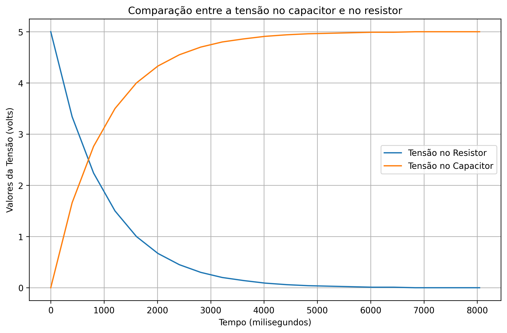

# Entrega 02 — Circuito RC: Carga e Descarga de Capacitor

Esta entrega apresenta a análise prática de um **circuito RC** (Resistor-Capacitor) através de simulação no TinkerCad e visualização de dados por meio de gráficos em Python.

## 📋 Objetivo

Observar e analisar o comportamento de **carga** e **descarga** de um capacitor em um circuito RC, medindo as tensões no resistor e no capacitor ao longo do tempo através do Monitor Serial do Arduino.

---

## 🔌 Componentes do Circuito

O circuito RC foi montado com os seguintes componentes:

- **Capacitor (C):** 10µF / 25V
- **Resistor de entrada (Re):** 1MΩ
- **Resistor de descarga (Rd):** 100Ω
- **Chave:** Para controlar o processo de carga/descarga
- **Arduino UNO:** Para leitura e envio dos dados ao Monitor Serial
- **Protoboard e fios de conexão**

### Diagrama do Circuito


A imagem acima mostra a montagem completa do circuito no TinkerCad, incluindo:

- Conexões do Arduino com o protoboard
- Posicionamento do capacitor (C = 10µF / 25V)
- Resistores Re (1MΩ) e Rd (100Ω)
- Chave para controle do circuito

---

## 🧪 Prática Realizada

### Etapas:

1. **Acesso ao TinkerCad:** Entrar na conta do [TinkerCad](https://www.tinkercad.com)
2. **Montagem do circuito:** Seguir o diagrama fornecido para montar o circuito RC
3. **Upload do código:** Utilizar o código Arduino fornecido ([link do código aqui](https://exemplo.com))
4. **Simulação:** Dar play no TinkerCad e observar o Monitor Serial
5. **Coleta de dados:** Copiar os valores exibidos no Monitor Serial

### Processo de Análise:

1. **Coleta dos dados do Monitor Serial** (tempo, tensão no capacitor, tensão no resistor)
2. **Geração de gráficos em Python** usando matplotlib
3. **Análise da carga no capacitor (C)**
4. **Análise da descarga no resistor (R)**
5. **Comparação dos comportamentos**

---

## 📊 Resultados: Gráficos de Tensão

Após coletar os dados do Monitor Serial, foram gerados gráficos para análise:



### Interpretação dos Gráficos:

#### 🔵 Tensão no Resistor (Curva Azul)

- **Início:** Tensão máxima de 5V (t = 0ms)
- **Comportamento:** Decaimento exponencial
- **Explicação:** No início, toda a corrente passa pelo resistor. Conforme o capacitor carrega, a corrente diminui e a tensão no resistor cai exponencialmente até chegar próximo de 0V.

#### 🟠 Tensão no Capacitor (Curva Laranja)

- **Início:** Tensão de 0V (capacitor descarregado)
- **Comportamento:** Crescimento exponencial
- **Explicação:** O capacitor começa descarregado e vai acumulando carga ao longo do tempo. A tensão aumenta exponencialmente até atingir aproximadamente 5V (tensão da fonte).

#### ⚡ Constante de Tempo (τ)

A constante de tempo do circuito RC é dada por:

$$\tau = R \times C = 1M\Omega \times 10\mu F = 10 \text{ segundos}$$

Isso significa que o capacitor atinge cerca de **63,2%** da tensão total em aproximadamente 10 segundos.

---

## 🐍 Código Python para Gráficos

O notebook Jupyter [`graficos.ipynb`](./graficos.ipynb) contém o código completo para geração dos gráficos.

Principais bibliotecas utilizadas:

- `matplotlib.pyplot` — para criação de gráficos

```python
# Exemplo de uso
import matplotlib.pyplot as plt

# Dados coletados do Monitor Serial
dados = [
   (0, 5.00, 0.00),
   (401, 3.34, 1.66),
   # ... demais dados
]

# Gerar gráfico
plt.plot(x, y1, label='Tensão no Resistor')
plt.plot(x, y2, label='Tensão no Capacitor')
plt.savefig('tensao_comparacao.png')
plt.show()
```

---

## 🎯 Conclusões

1. **Carga do Capacitor:** Segue uma curva exponencial crescente, começando em 0V e atingindo ~5V
2. **Descarga no Resistor:** Segue uma curva exponencial decrescente, começando em 5V e caindo para ~0V
3. **Conservação de Energia:** A soma das tensões no resistor e capacitor permanece constante (~5V), demonstrando a lei de Kirchhoff
4. **Comportamento complementar:** As curvas são complementares — quando uma sobe, a outra desce

---

## 📂 Estrutura de Arquivos

```
entrega_02/
├── readme.md                    # Este arquivo
├── graficos.ipynb              # Notebook Python com código dos gráficos
└── assets/
    ├── circuito_e_codigo.jpeg  # Imagem do circuito montado
    └── tensao_comparacao.png   # Gráfico de comparação das tensões
```

---

## 👨‍💻 Autor

Christian Gandra - Inteli (Instituto de Tecnologia e Liderança)

---

**Data de entrega:** 20 de Outubro de 2025
